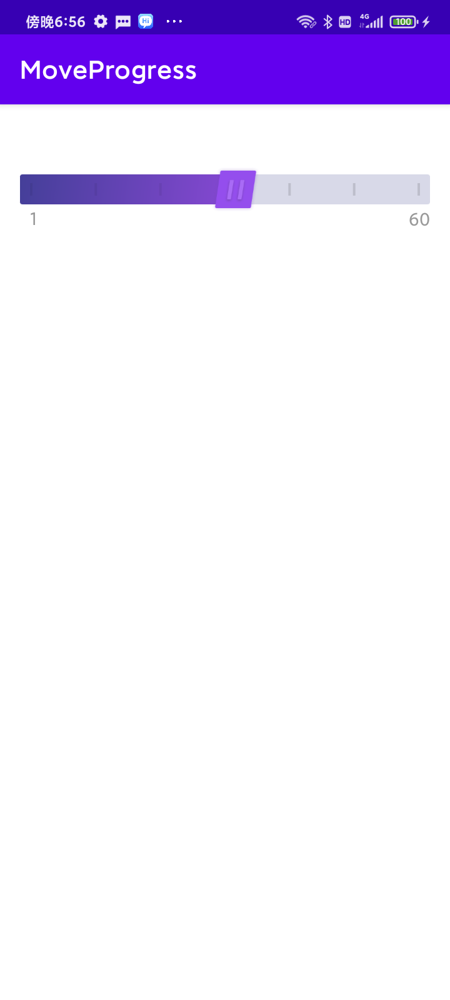

# MoveProgress
自定义带有坐标尺的拖拽进度条。
## 效果展示



## 快速开始

1、在你的根项目下的build.gradle文件下，引入maven。

```groovy
allprojects {
    repositories {
        maven { url "https://gitee.com/AbnerAndroid/almighty/raw/master" }
    }
}
```
2、在你需要使用的Module中build.gradle文件下，引入依赖。

```groovy
dependencies {
    implementation 'com.vip:moveprogress:1.0.0'
}
```
3、XML引入即可

```xml
    <com.vip.moveprogress.MoveProgress
    android:layout_width="match_parent"
    android:layout_height="wrap_content"
    app:ms_graduation_hide_center="true" />

```

### 相关属性

| 属性                                   | 类型        | 概述             |
| ------------------------------------ | --------- | -------------- |
| ms_height                            | dimension | View视图的高度      |
| ms_progress_height                   | dimension | 进度条的高度         |
| ms_progress_thumb                    | reference | 进度条的Icon       |
| ms_progress_margin_top_bottom        | dimension | 进度条距离icon的上下距离 |
| ms_progress_margin_left_right        | dimension | 进度条距离左右的边距     |
| ms_progress_radius                   | dimension | 进度条的圆角         |
| ms_progress_background               | color     | 进度条的背景颜色       |
| ms_interval_color                    | color     | 间隔线颜色          |
| ms_interval_select_color             | color     | 间隔线选中颜色        |
| ms_interval_parent_margin_left_right | dimension | 间隔线距离父左右       |
| ms_interval_size                     | integer   | 间隔线数量          |
| ms_interval_width                    | dimension | 间隔线宽度          |
| ms_interval_margin_top_bottom        | dimension | 间隔线上下边距        |
| ms_progress_move_color               | reference | 定义的移动颜色        |
| ms_progress_max                      | integer   | 最大进度           |
| ms_progress_default                  | integer   | 默认进度           |
| ms_is_graduation                     | boolean   | 是否显示刻度尺        |
| ms_graduation_text_size              | dimension | 刻度尺文字大小        |
| ms_graduation_text_color             | color     | 刻度尺文字颜色        |
| ms_graduation_select_text_color      | color     | 刻度尺文字选中颜色      |
| ms_graduation_section                | integer   | 刻度值段           |
| ms_graduation_section_zero           | boolean   | 刻度值段从零开始       |
| ms_graduation_hide_center            | boolean   | 刻度值段中间是否隐藏     |
| ms_graduation_margin_top             | dimension | 刻度值距离上边的距离     |
| ms_progress_thumb_width              | dimension | icon的宽         |
| ms_progress_thumb_height             | dimension | icon的高         |
| ms_progress_thumb_margin_top         | dimension | icon距离上边的高度    |
| ms_progress_thumb_spacing            | dimension | icon的内边距       |
| ms_progress_disallow_intercept       | boolean   | 是否拦截           |
| ms_progress_is_intercept             | boolean   | 是否禁止拖拽         |

### 相关方法

| 方法                     | 参数      | 概述       |
| ---------------------- | ------- | -------- |
| getProgress            | 无参      | 返回当前进度   |
| changeProgress         | Int     | 改变当前进度   |
| getMoveProgress        | 返回Int   | 回调函数     |
| setProgressIsIntercept | Boolean | 设置是否进行拦截 |


## 文章介绍

[Android实现一个可拖拽带有坐标尺的进度条](https://juejin.cn/spost/7245118640411983909)

## 欢迎关注作者

微信搜索【Android干货铺】，或扫描下面二维码关注，查阅更多技术文章！


## License

```
Copyright (C) AbnerMing, MoveProgress Open Source Project

Licensed under the Apache License, Version 2.0 (the "License");
you may not use this file except in compliance with the License.
You may obtain a copy of the License at

     http://www.apache.org/licenses/LICENSE-2.0

Unless required by applicable law or agreed to in writing, software
distributed under the License is distributed on an "AS IS" BASIS,
WITHOUT WARRANTIES OR CONDITIONS OF ANY KIND, either express or implied.
See the License for the specific language governing permissions and
limitations under the License.
```
